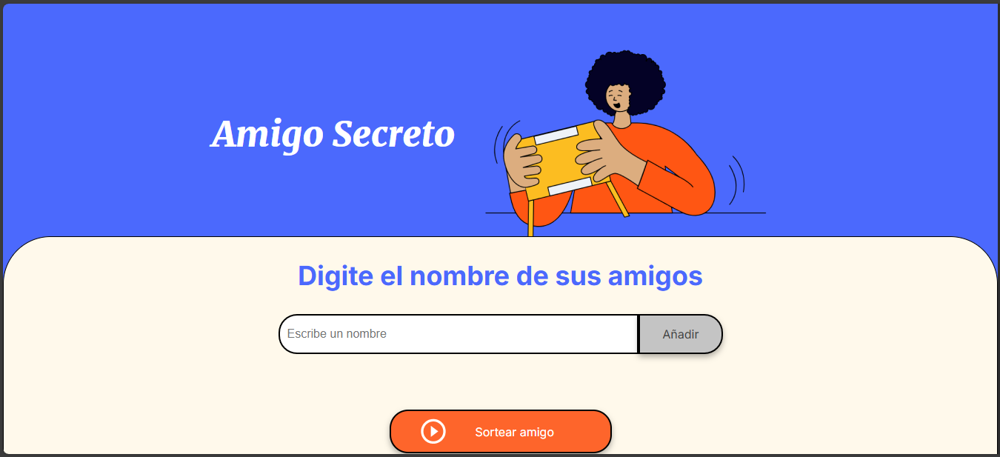
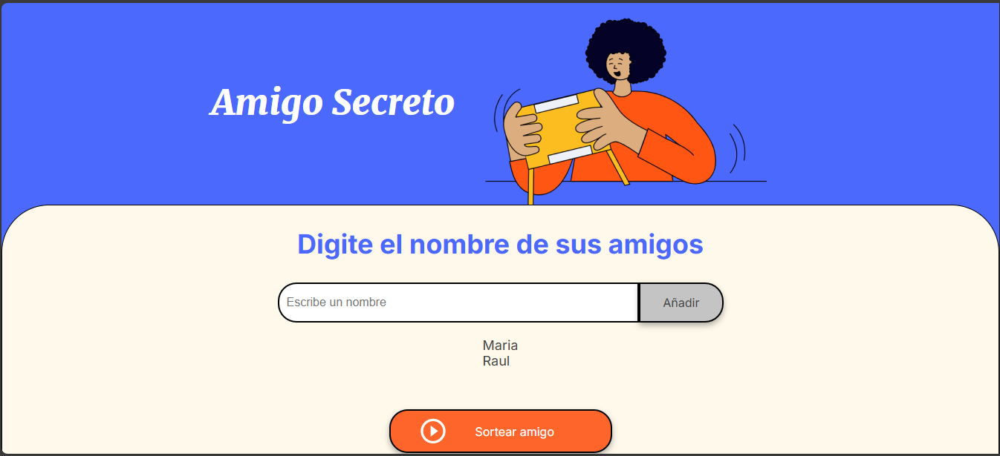
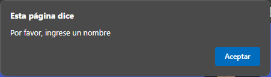
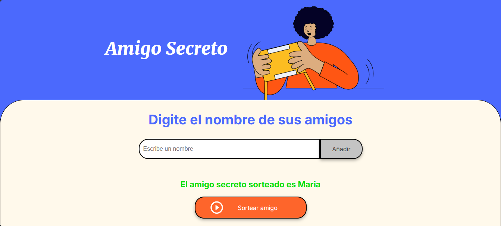

# alura-amigo-secreto
Challenge 1 Alura Amigo Secreto

## Índice de archivos

| Contenido | Descripción |
|-----------|-------------|
| `assets` | Visuales utilizadas dentro del proyecto |
| `app.js` | Funciones creadas para interacción del usuario |
| `index.html` | Aprovisionamiento de la estructura principal del proyecto |
| `style.css` | Estilos aplicados al proyecto |

## Índice de contenidos
* [Challenge Amigo Secreto](#Challenge-Amigo-Secreto)
* [Descripción](#Descripción)
* [Demostración de funcionalidad](#Demostración-de-funcionalidad)
* [Tencologías implementadas](#Tencologías-implementadas)

## Challenge Amigo Secreto

Este es un proyecto desarrollado para el curso de Practicando Lógica de Programación del programa formación de Alura Latam.

## Descripción

Proyecto finalizado y cargado para revisión.

## Demostración de funcionalidad

### 1. Pantalla de bienvenida

### 2. Generación de listado de amigos: 
#### Al presionar el boton `Añadir`, los nombres ingresados por el usuario se agregan a una lista mostrada en la parte inferior.

#### Si se intenta agregar un valor `vacio`, se generará un alert solicitando un nombre.

### 3. Selección de amigo
#### Al presionar el boton de `Sortear amigo`, se genera el texto con el nombre el amigo sorteado.

## Tencologías implementadas

